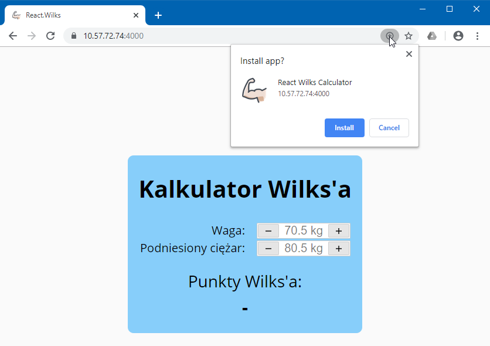
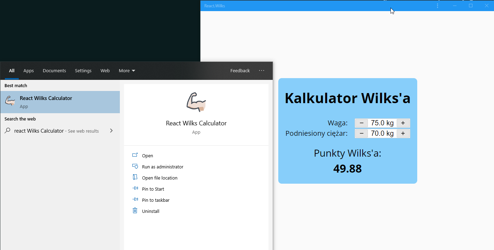

# React.Wilks

Simple Wilks Calculator (powerlifting) created with React as Progressive Web App.

## How to use

1. Use [mkcert](https://github.com/FiloSottile/mkcert) to generate certificate for localhost (or ip address).
2. Type path to generated certificate in `server/index.js` 